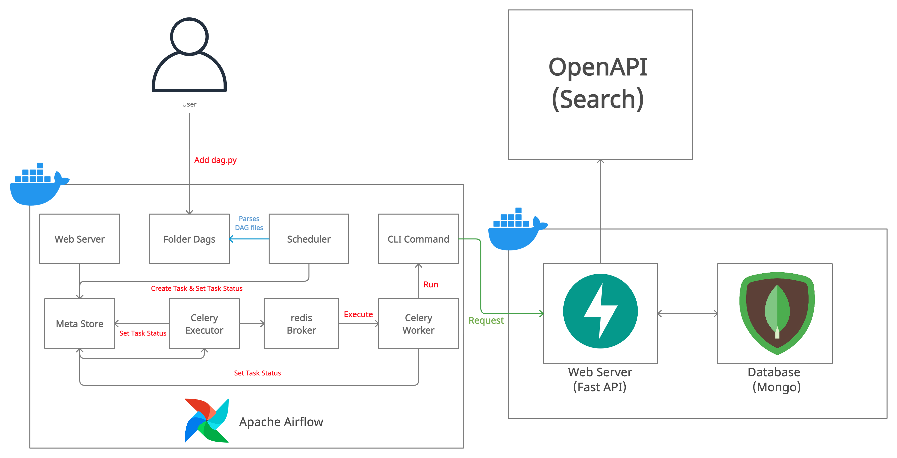

# **Apache Airflow를 활용한 Fast API 호출을 통해 데이터 수집 및 처리**

## **Overview**

이번 프로젝트에서는 Apache Airflow와 Fast API 서버 애플리케이션을 Docker에 올려서 구성하였으며, Fast API 서버 애플리케이션에서 Open API의 검색 엔진을 통해 데이터를 정기적으로 수집 및 처리하도록 하였습니다. 

적재된 데이터는 별도의 Apache Airflow에 작성한 DAG를 통해 SQL query 처리를 하고, 데이터를 가공하여 데이터베이스에 적재합니다. 

## **Dataset**

프로젝트에서 사용하게 될 데이터는 Naver 및 Kakao에서 제공되는 Open API의 검색 엔진을 활용하여 수집하였습니다. 

## **Objective**

이번 프로젝트를 통해 Apache Airflow를 활용하여 DAG를 작성하고, 데이터 수집과 변환, 그리고 적재의 과정을 Operator를 사용하여 세부 Task로 분류하여 작성하는 실습을 할 것 입니다. 그리고 Fast API로 작성한 애플리케이션을 Docker로 컨테이너화하여, API request를 Apache Airflow를 통해 할 수 있도록 구성해 볼 것입니다. 


### **[Data aggregation & Loading]**

- 

<br/>

## **Data Architecture**



### **(1) Apache Airflow를 선택한 이유**

이번 프로젝트에서 Apache Airflow를 구성한 이유는 정기적으로 API 애플리케이션에 요청해서 Open API의 검색 엔진으로부터 데이터를 추가 수집하도록 처리하기 위해서 입니다. 

더 나아가 적재된 MongoDB 데이터베이스의 데이터를 Operator를 사용하여 작성한 Task를 통해 정제하고, 적재하도록 합니다.  

### **(2) API 어플리케이션 개발시, Fast API 프레임워크를 선택한 이유**

Fast API를 사용하여 아키텍처를 구성한 이유는  가장 손쉽게 도커 컨테이너 이미지로 만들 수 있도록 도와주는 웹 프레임워크이며, 비동기 처리를 지원하기 때문입니다. 데이터 수집에 있어, 비동기 처리는 특정 프로세스의 처리에 시간이 걸리더라도 그 시간동안 다른 작업을 처리할 수 있기 때문에 자원을 효율적으로 사용할 수 있다는 장점이 있다.

따라서 외부 API로부터 데이터 수집시 발생하는 Network I/O 바운드에서도 효율적으로 자원을 사용하여 요청을 처리할 수 있다. 

<br/>

## **DAG Task flow**


DAG의 Task 흐름은 우선 is_api_available Task를 통해서 FastAPI로 요청할 API method가 호출 가능한지 확인하는 과정을 거치게 됩니다. 해당 Task가 완료되면, FastAPI로 API method를 호출하게 되고, OpenAPI의 검색 엔진으로부터 데이터를 취득해서 MongoDB에 데이터가 적재됩니다. 

본 프로젝트에서는 두 OpenAPI의 검색 엔진으로부터 데이터를 수집하기 때문에 앞서 설명한 과정이 `etl_group1`, `etl_group2`로 나뉘어 병렬처리됩니다. 

API로의 요청 처리가 완료되면, MongoDB에 적재된 데이터를 읽어서 데이터 전처리를 하고, 다시 전처리된 데이터를 MongoDB에 적재합니다.

<br/>

## **Data Visualization**

데이터 시각화는 

<table>
    <tr>
        <th style="text-align:center">NO</th>
        <th style="text-align:center">Image</th>
        <th style="text-align:center">Description</th>
    </tr>
    <tr>
        <td>1</td>
        <td>
            
        </td>
        <td>
            <b>[]</b><br/>
            <small></small>     
        </td>
    </tr>
</table>

## **Prerequisites**

- Docker Desktop 설치
- 코드를 실행할 IDE (VSCODE, Sublime Text 등) 설치
- Python : 3.6 and later
- MongoDB : 4.0 and laters

<br/>
ㄴ
## **How to Run This Project** 

1. 프로젝트 폴더의 api 폴더 내로 이동하고, docker-compose.yml 파일을 실행하여 FastAPI의 Docker container를 생성한다.

    ```zsh
    $cd ./api
    $docker-compose up -d
    ```

3. 브라우저에서 `localhost:8000/`로 접속하여 생성한 FastAPI Docker Container로 접속이 가능한지 확인을 한다. 

4. 프로젝트 폴더의 airflow 폴더 내로 이동한 후 airflow 폴더의 하위에 .env 파일을 생성하여 아래와 같이 환경변수를 입력한다. 
    
    ```zsh
    AIRFLOW_IMAGE_NAME=apache/airflow:2.3.0
    AIRFLOW_UID=50000
    ```

5. docker-compose.yml 파일을 실행하여 Apache Airflow의 Docker container를 생성한다.

    ```zsh
    $docker-compose up -d
    ```

6. airflow 폴더 하위에 실행하고자 하는 Task들로 구성된 Dag 파일을 작성한다. (`DAG파일은 airflow/dags 폴더의 하위에 위치`)

    이는 Scheduler에 의해 parsing되어 생성된 DagRun object와 Task Object Instance가 MetaStore로 상태 정보와 함께 생성된다. 

6. Apache Airflow의 [Admin]-[Connections]에서 Docker로 띄운 Fast API 애플리케이션(localhost:8000) 컨테이너에 연결하는 객체를 생성한다.
    
    Connection 생성시, Host는 `host.docker.internal`로 해줘야 Docker 외부 host의 localhost로 접근이 가능하다.

    ```zsh
    Connection Id : fast_api
    Connection Type : HTTP
    Host : host.docker.internal
    Login : airflow
    Password : airflow
    Port : 8000
    ```

7. Airflow의 DAGs 메뉴를 통해서 작성한 DAG를  Trigger시켜서 제대로 Task가 실행이 되는지 확인한다.

8. 프로젝트의 api 폴더 하위에 `secrets.json`파일을 생성하고 아래의 내용을 추가한다.

    ```json
    {
        "NAVER_API_ID": [NAVER_API_ID],
        "NAVER_API_SECRET": [NAVER_API_SECRET],
        "MONGO_DB_NAME": "fastapi-pj",
        "MONGO_URL": [MONGO_URL]
    }
    ```

## **Lessons Learned**

이번 프로젝트를 통해서 본래 학습 계획에 있었던 Apache Airflow의 사용에 좀 더 익숙해지는 계기가 되었던 것 같습니다. 데이터 파이프라인의 각 각의 Task를 Operator를 사용하여 작성하고, 작성한 DAG를 통해 최종적으로 Task들을 실행해보면서, 특정 시점의 Task에서 에러가 발생시 로그를 보면서 디버깅해보는 연습도 해보았습니다.
그리고 Fast API 프레임워크를 사용하여 직접 API 애플리케이션을 만들어보고, API request를 Airflow를 통해서 정기적으로 요청하여 데이터를 수집하면서, 이전에 AWS의 EventBridge 서비스를 사용했을 때 보다 좀 더 파이프라인의 Task를 세부적으로 커스텀할 수 있다고 생각했습니다.

또한 실무에서도 데이터 수집을 위해 직접 작성한 API 애플리케이션을 Airflow를 통해 정기적으로 데이터베이스에 수집되도록 해놓으면, 좀 더 효율적으로 데이터 분석가나 데이터 사이언티스트들이 업무적으로 활용할 데이터를 수집할 수 있을 것이라고 생각했습니다.

## **Issue**

(1) Dockerized Apache Airflow에서 DAG의 Task에서 사용할 connection에 대한 정의를 할 때 host를 어떻게 정의해야 될지 혼동이 되었었습니다.

`solution)` Docker 내에서 localhost는 Docker 자체의 localhost가 되기 때문에 `host.docker.internal`로 해야 host의 localhost(127.0.0.1)로 설정할 수 있습니다. 
